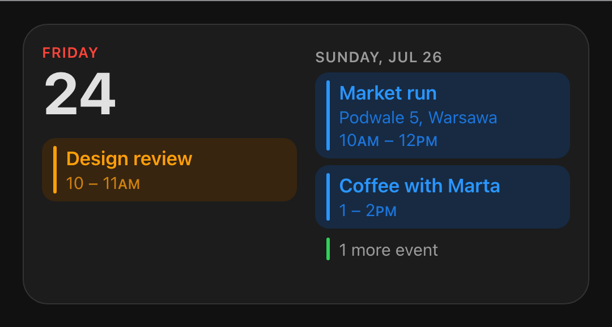
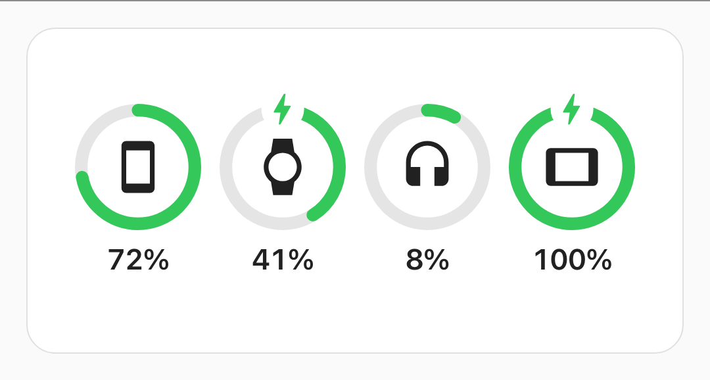
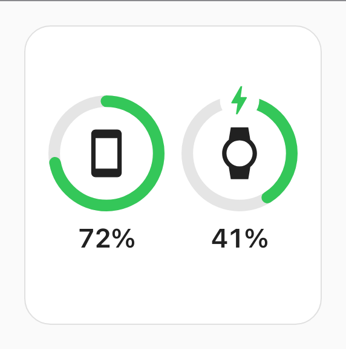
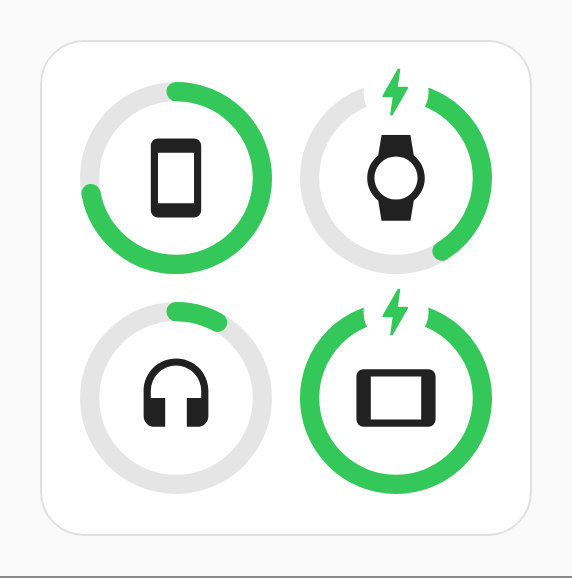
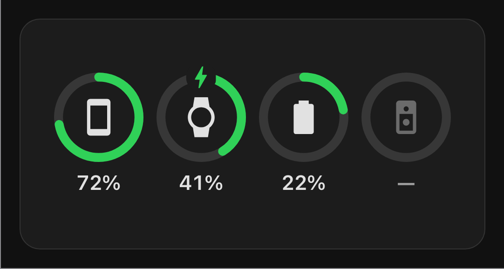
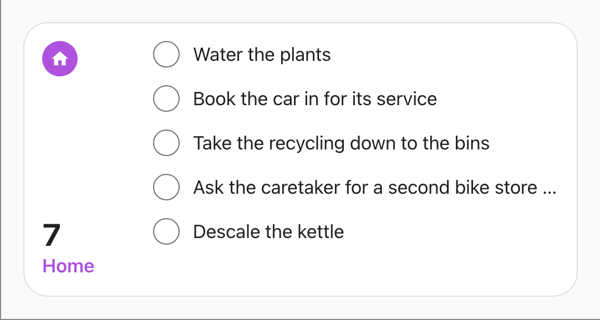
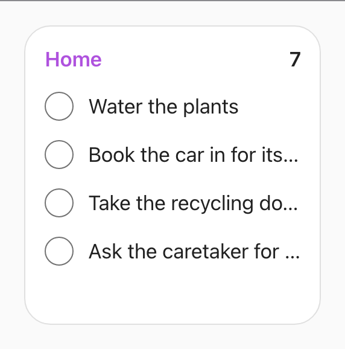
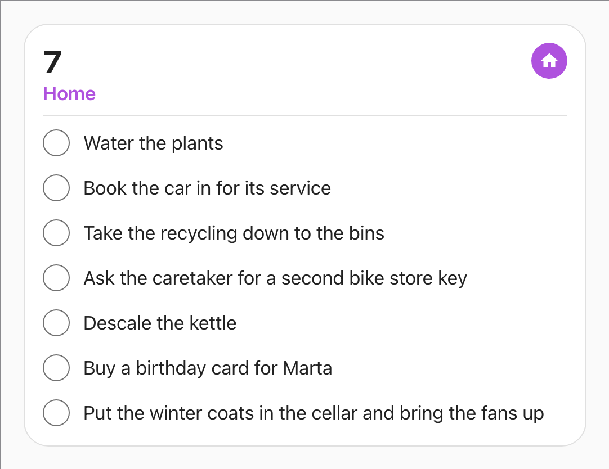
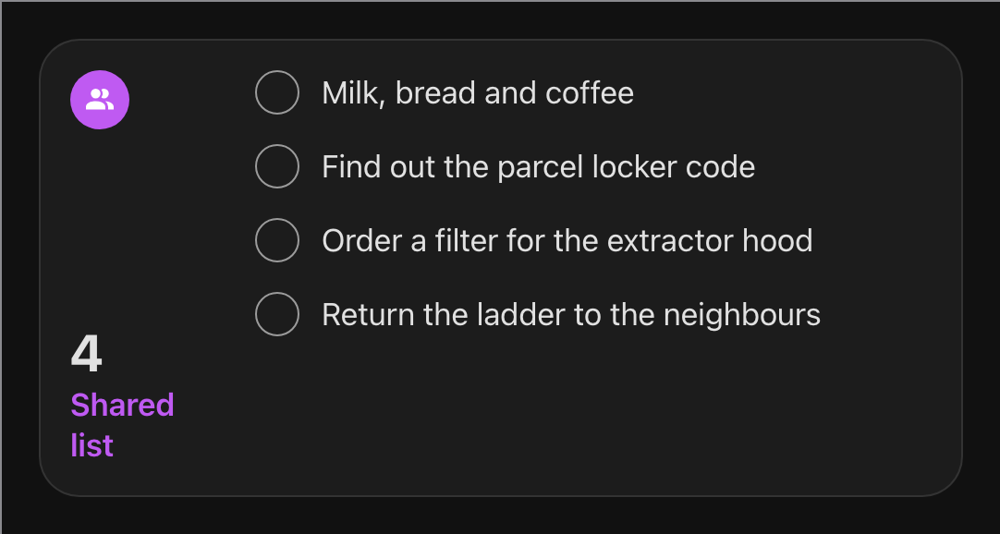

# Cupertino Widgets

Widget cards for [Home Assistant](https://www.home-assistant.io/) dashboards, styled like the
ones on a phone's home screen: sensible defaults instead of a config to fill in, and a shape
taken from the box you drag them into rather than from a size setting.

**[Live demo](https://sabbaken.github.io/cupertino-widgets/)** ·
**[Install](#install)** ·
**[The calendar](#the-calendar)** ·
**[The batteries](#the-batteries)** ·
**[The reminders](#the-reminders)** ·
**[Card rules](docs/calendar-widget-rules.md)** ·
**[Ring rules](docs/battery-widget-rules.md)** ·
**[List rules](docs/reminders-widget-rules.md)**

[](https://ko-fi.com/sabbaken)
[](https://buymeacoffee.com/sabbaken)

[](https://github.com/sabbaken/cupertino-widgets/actions/workflows/ci.yml)
[](https://github.com/sabbaken/cupertino-widgets/actions/workflows/release.yml)
[](./LICENSE)
[](https://www.home-assistant.io/)

The demo runs every size live, with sample data and the clock under your control, and hands
you the config to paste when you like what you see: nothing to install to look.

> **Status: early.** Three cards. The calendar draws your real calendars and to-do lists and
> lays itself out exactly like the phone's. The battery card draws any battery sensors you
> point it at. The reminders card draws one to-do list, and ticking something off it on the
> dashboard is the one thing in the library that writes back to Home Assistant.
>
> It needs a current Home Assistant, **2026.7 or newer**: the cards track the latest
> frontend APIs rather than carrying compatibility shims.

## The calendar

Today's date, then today's events, then as much of the days after today as the card has
room for, one continuous flow poured through however many columns the footprint gives it.
Each event is tinted with the colour of the calendar it came from, and anything due out of
your to-do lists joins the same flow at its own time. Empty days are not listed as empty,
they simply do not appear, and whatever is left of the day the card ran out of room in
becomes `2 more events`.

<table>
  <tr>
    <td align="center" valign="top" width="50%">
      
      <br />
      <sub><b>Medium.</b> A full day, then tomorrow. <code>Dentist</code> is still today;
      the flow simply ran out of left column.</sub>
    </td>
    <td align="center" valign="top" width="50%">
      
      <br />
      <sub><b>Small.</b> Today and nothing else, ever. The badge is an all-day event, which
      has no time to show and so gets a row to itself.</sub>
    </td>
  </tr>
  <tr>
    <td align="center" valign="top">
      
      <br />
      <sub><b>A quiet day.</b> Nothing today, so it says so, and rather than leave the
      other column empty as well, the flow starts there with tomorrow.</sub>
    </td>
    <td align="center" valign="top">
      
      <br />
      <sub><b>Dark theme.</b> It follows the one you picked in Home Assistant. Tomorrow is
      empty here, so it is skipped, and the heading becomes a date, because
      <code>TOMORROW</code> has to mean literally tomorrow.</sub>
    </td>
  </tr>
</table>

Those are fixtures rather than anybody's real week. What the card decides to show, and in
what order, is written down in
[`docs/calendar-widget-rules.md`](docs/calendar-widget-rules.md), down to why `5 – 6PM`
prints only one `PM`.

## The batteries

A ring per device, green all the way, with the level read off the length of the arc and a bolt
on whatever is charging. Point it at the battery sensors you actually care about and it works
out the rest: how many rings across, whether there is room for the percentages, and how big to
draw them. **Four devices per card at these two sizes**: two across in the square, four across
in the wide one.

<table>
  <tr>
    <td align="center" valign="top" width="50%">
      
      <br />
      <sub><b>Medium.</b> Four devices fit one row, so they keep their percentages. The bolts
      are the two on a charger.</sub>
    </td>
    <td align="center" valign="top" width="50%">
      
      <br />
      <sub><b>Small.</b> One or two devices in the square is the left half of the medium card,
      percentages and all.</sub>
    </td>
  </tr>
  <tr>
    <td align="center" valign="top">
      
      <br />
      <sub><b>Three or more in the square.</b> The percentages come off and the grid closes up;
      a caption is worth a row of its own, and past one row there is nowhere to keep buying
      it.</sub>
    </td>
    <td align="center" valign="top">
      
      <br />
      <sub><b>Dark theme.</b> It follows the one you picked in Home Assistant. The last ring is
      empty with its icon dimmed and a dash for a reading, since that device has stopped
      reporting, which is a thing the card says rather than hides.</sub>
    </td>
  </tr>
</table>

The ring is green at 5% as much as at 95%, and that is on purpose: the arc's length is already
the reading, so a colour changing underneath it would be a second, coarser version of the same
number. [`docs/battery-widget-rules.md`](docs/battery-widget-rules.md) has the whole argument,
along with every rule above.

## The reminders

One to-do list: how many things are still on it, what the list is called, and as many of them
as the card has room for. **Tap one to tick it off.** The row stays where it is for five
seconds so a tap you did not mean can be taken back, and then it goes. Tap the count, the name
or the badge and the to-do panel opens on that list.

<table>
  <tr>
    <td align="center" valign="top" width="50%">
      
      <br />
      <sub><b>Medium.</b> The badge, the count and the name are a column beside the rows, which
      leaves the list the full height of the card. Five of the seven fit; the count says so.</sub>
    </td>
    <td align="center" valign="top" width="50%">
      
      <br />
      <sub><b>Small.</b> No room for a badge, so the name and the count share the heading's one
      line. Titles that run out of room are truncated rather than wrapped.</sub>
    </td>
  </tr>
  <tr>
    <td align="center" valign="top">
      
      <br />
      <sub><b>Large.</b> Drag it taller and the heading moves above the rows, which is what buys
      them the whole width: the title that was truncated in the wide card fits here.</sub>
    </td>
    <td align="center" valign="top">
      
      <br />
      <sub><b>Dark theme.</b> It follows the one you picked in Home Assistant. A list shorter
      than the box simply ends; nothing is padded out to fill it.</sub>
    </td>
  </tr>
</table>

Ticking something off calls `todo.update_item` at once rather than waiting out the five
seconds, so every other Home Assistant client sees it immediately and closing the dashboard
cannot lose it. The five seconds are the card holding the row on screen against a list that has
already moved on, which is also what makes the tick appear under your finger instead of a round
trip later. A list that does not accept updates is drawn exactly the same and simply does not
respond: no tap target, no tab stop, and nothing announcing a checkbox that would fail.
[`docs/reminders-widget-rules.md`](docs/reminders-widget-rules.md) has every rule above,
including why there is no repeat glyph: Home Assistant has no recurrence to draw one from.

## Install

Through [HACS](https://hacs.xyz/), which is where a dashboard card belongs; it registers the
resource for you and tells you when there is a new version.

1. Open **HACS** in the Home Assistant sidebar.
2. **⋮** in the top right → **Custom repositories**.
3. Paste `https://github.com/sabbaken/cupertino-widgets` into **Repository**, pick
   **Dashboard** as the **Type**, and press **Add**.
4. Search HACS for **Cupertino Widgets**, open it, and press **Download**.
5. Reload the browser once, so the dashboard picks the new resource up.

Then add a card. The next section shows how.

## Adding a card

All three cards are in the dashboard's card picker (**Cupertino Calendar**, **Cupertino
Batteries** and **Cupertino Reminders**), and each has a visual editor, so there is no YAML to
write unless you want to.

### The calendar

Five fields: **Calendars**, which calendars feed it; **Reminders**, whether your to-do items
are drawn beside the events; **To-do lists**, which lists those come from; **Clock**, which
format it prints times in; and **Scale**, how large to draw it. Leave all of them alone and
you get every calendar, every to-do list, your Home Assistant time format, and 100%.

The equivalent YAML, if you prefer it:

```yaml
type: custom:cupertino-widgets-calendar
entities: # optional; leave it out for every calendar
  - calendar.work
  - calendar.personal
show_reminders: true # optional; false leaves your to-do lists out entirely
todo_entities: # optional; leave it out for every to-do list
  - todo.chores
time_format: system # optional; system | 12 | 24
scale: 100 # optional; 80–130, percent
```

| Option           | Default          | Meaning                                                          |
| ---------------- | ---------------- | ---------------------------------------------------------------- |
| `entities`       | every calendar   | Which `calendar.*` entities to draw. Omit it rather than empty.  |
| `show_reminders` | `true`           | Whether reminders are drawn. `false` reads no to-do list at all. |
| `todo_entities`  | every to-do list | Which `todo.*` entities to read. Omit it rather than empty.      |
| `time_format`    | `system`         | `system` follows your profile; `12` or `24` overrides it.        |
| `scale`          | `100`            | Percent. Draws the whole widget larger or smaller. 80–130.       |

`12`, `24` and `scale` are read whether or not you quote them.

**On reminders.** A reminder is a to-do item with a **due date**: the date is what gives it a
day to be drawn on, so an item without one never appears, and neither does one you have ticked
off. An item due at a time reads like an event, with the time under its title; one due on a
date reads as a single line, with no invented midnight under it. Both are drawn in the same
stream as the events rather than in a section of their own, which is where a to-do due at half
past ten belongs: between the nine o'clock meeting and the noon one.

**On `system`.** It follows the time format in your Home Assistant profile, and that
setting's own auto-detection reads the browser's locale, which is the only channel a
browser offers. A Mac set to AM/PM behind a browser set to British English detects 24-hour
and there is no web API that would know better. That is what `12` and `24` are for.

Colours come from the colour set on each calendar in Home Assistant's entity settings, and
otherwise from this library's own palette, dealt in the same order Home Assistant's own
calendar panel deals its own, so a calendar keeps the colour you have got used to. A to-do
list has no colour to take in Home Assistant, so its circle comes from that palette by the
position of the list. Every calendar and every list is subscribed to rather than polled, so
the card follows Home Assistant as events and items change.

### The batteries

A list of devices, then **Scale**. This is the one card that draws nothing useful before it is
configured: it says `No Devices`, because an installation's battery sensors are every remote,
every valve and every door contact, and no order over them would be the one you meant.

Press **Add a device** (which opens the list of sensors straight away), pick one, and it joins
the list as a panel of its own. Open
the panel and everything about that device is in one place: which **battery sensor**, its
**icon**, its **charging sensor** and its **name**. Drag a panel by the handle to move its ring;
the bin in its header removes it. Each field shows what the card will draw if you leave it
empty, and the picker does not offer a sensor that is already in the list, so nothing here
needs YAML.

```yaml
type: custom:cupertino-widgets-battery
entities:
  - sensor.phone_battery
  - sensor.watch_battery
  # a row can carry more than an id, for the things a sensor cannot say itself:
  - entity: sensor.tablet_battery
    charging_entity: binary_sensor.tablet_charging
    name: Tablet
    icon: mdi:tablet
scale: 100 # optional; 80–130, percent
```

| Option            | Default          | Meaning                                                           |
| ----------------- | ---------------- | ----------------------------------------------------------------- |
| `entities`        | none             | Which devices, in the order the rings follow. Ids or rows.        |
| `charging_entity` | the sensor's own | A `binary_sensor` that is `on` while the device charges.          |
| `name`            | `friendly_name`  | Tooltip and screen-reader label only; never drawn.                |
| `icon`            | the sensor's own | Any `mdi:` name. This is the only thing that says _which_ device. |
| `scale`           | `100`            | Percent. Draws the whole widget larger or smaller. 80–130.        |

**Four rings, and a longer list is not an error.** Both sizes here draw four devices and stay
quiet about the rest, so a card given six shows the first four and looks pixel-for-pixel like
a card given four. Writing six now is groundwork for a `large` size with two rows to put them
in; until then four is the design rather than a shortfall, and the wide card in particular does
not stack a stub row under a full one.

**Worth setting `icon`.** Home Assistant computes a battery sensor's icon from its level, so
without one you get a battery glyph inside a battery ring, six times over. It sits under the
battery sensor in a device's panel, and it is the one thing on this card that says _which_
device a ring is. The only sensor the picker cannot offer you is a battery percentage published
without the `battery` device class; that one still works, it just has to be named in YAML.

**Charging is detected without help** where the sensor says so itself: `is_charging` or
`battery_state` on its attributes, which is what many integrations publish. `charging_entity`
is for the rest, and it is the separate binary sensor the companion app and friends ship.

A device whose sensor cannot be read is still drawn: an empty ring, a dimmed icon and a dash
instead of a percentage. That is the point of putting the card up.

### The reminders

One picker, then **Scale**. Choose the to-do list and there is nothing else to answer: the name
on the card, the number over it, the glyph on the badge and how many rows fit are all worked
out from the list and the box.

```yaml
type: custom:cupertino-widgets-reminders
entity: todo.shopping
scale: 100 # optional; 80–130, percent
```

| Option   | Default | Meaning                                                    |
| -------- | ------- | ---------------------------------------------------------- |
| `entity` | none    | The `todo` list this card is about. One list per card.     |
| `scale`  | `100`   | Percent. Draws the whole widget larger or smaller. 80–130. |

**One list per card, and that is the design.** The whole heading is a list's name over a count
of that list's items, so a card over two lists would have to be told what to call itself and
which of them a tap should open. Two lists are two cards. If what you want is several lists
poured together by day, that is the calendar card, which draws to-do items with a due date
alongside your events.

**Nothing is filtered out.** Every item still to do is a row, dated or not, in the order the
list is kept in. The card does not sort, because your list is already sorted the way you left
it and the panel a tap opens will show it that way too.

**No `+N more`.** The count over the name has already said how many things there are, so a card
drawing three rows under a `9` has reported the six it could not fit; saying it twice would cost
a row that could have held one of them.

**A list that cannot be written to is read-only here too.** Its rows look the same, and none of
them is a tap target, a tab stop or a checkbox to a screen reader. Home Assistant's own to-do
card disables its checkboxes on the same flag rather than removing them, and for the same
reason: a row that lost its circle would read as a different kind of row, where a control that
answers a tap with a red toast is simply a control that does not work.

## How big it is

**There is no size option.** Resize a card the normal way (the **Layout** tab in the dashboard
editor) and it works out which widget shape fits the box you gave it. The calendar shows today
in the square and today plus what follows it in the wider 2:1; the battery card puts two rings
across the square and four across the 2:1; the reminders card puts its heading on one line in
the square and beside the rows in the 2:1. The line is at 340px of card, roughly 9 of the 12
columns in a section of the usual width, and it moves with `scale`, because larger type needs
more room before two columns of it stop truncating every title.

| footprint       | comes out at  | shape                           |
| --------------- | ------------- | ------------------------------- |
| **6 × 4** rows  | ~246 × 248 px | the small square                |
| **12 × 4** rows | ~500 × 248 px | the medium 2:1                  |
| **12 × 6** rows | ~500 × 376 px | the large panel, reminders only |

The third is the reminders card's alone, and it is the one shape that comes from the height
rather than the width: past 340px of it the heading moves above the rows and they get the whole
width. The other two cards are the same card in a taller box, with more of the week or bigger
rings.

Everything between and around them works too; that is the whole point of measuring the box
instead of reading a preset. A card dragged taller fills the extra height rather than leaving it
blank: the calendar with more rows of the week, the battery card with bigger rings, since its
rows are its devices and there is nothing else to put there. One dragged narrow folds to a
single column, or to two rings across. But those two footprints are the proportions the content
was laid out for. A new card arrives full width and 4 rows tall, and can be dragged down to 4
columns by 3 rows; a square that short holds the date and the next event and nothing else, so it
is one to leave at 100% or below.

**`scale` is the other question.** The footprint settles how much room the card has; `scale`
settles how large what goes in it is drawn: the type at 80% or 130% of the size above, along
with the spacing around it, for a wall tablet read from across the room or a dense dashboard
read at a desk. One factor over the whole widget, so the card at 120% is the card at 100% seen
from closer up rather than a differently proportioned one.

It is spent out of whatever the card has to give, which is the trade worth knowing about. On the
calendar that is rows: the same footprint that holds 4 under the date and 7 in the second column
at 100% holds 2 and 5 at 130%, and 6 and 9 at 80%, so a card scaled up wants dragging taller and
a card scaled down fills the height it has with more of the day. On the battery card the rows
are the devices and cannot be given up, so the rings shrink instead: the same four devices in
the same box, drawn smaller. Values outside 80–130 are clamped rather than refused.

The Layout tab writes its footprint into `grid_options`, which is Home Assistant's own and
belongs to every card rather than to this one.

## The widgets

| Widget                          | Status                      |
| ------------------------------- | --------------------------- |
| Calendar                        | events, live                |
| Battery levels                  | live                        |
| Reminders, in the calendar card | to-do items with a due date |
| A to-do list of its own         | live, and tickable          |

## Development

`pnpm dev` serves the showcase with no Home Assistant needed, `pnpm test` runs the layout
rules as unit tests. [`docs/development.md`](docs/development.md) has the rest: the two
loops, how the screenshots are generated, and where everything lives.

## Licence

[GNU Affero General Public License v3.0](LICENSE) (`AGPL-3.0-only`).
